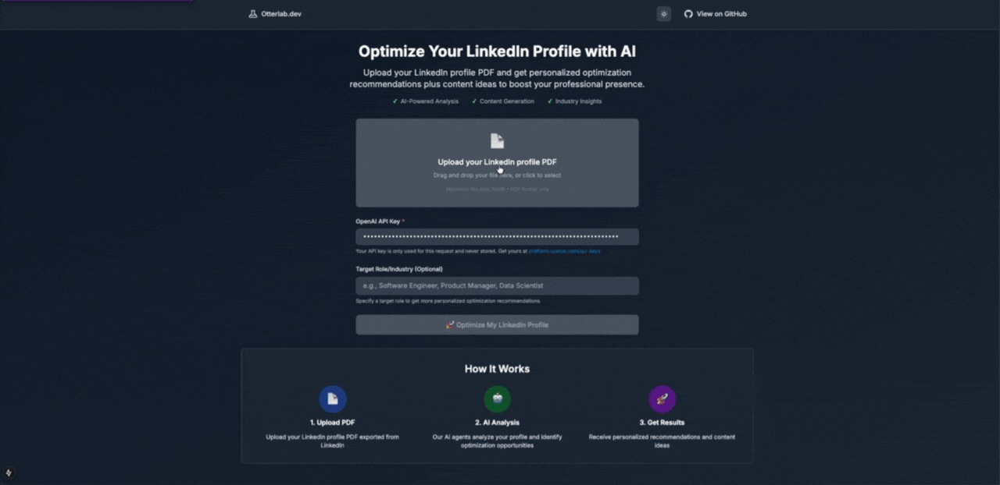

# LinkedIn Profile Optimizer


**Transform your LinkedIn presence in under 2 minutes.**

An intelligent multi-agent system powered by GPT-4 that extracts, analyzes, and optimizes your LinkedIn profile while generating personalized content strategies. Built with **LangGraph orchestration**, **3 specialized AI agents**, and **real-time progress tracking**, delivering professional recommendations faster than a hiring manager can scroll through your profile.





**🚀 What makes it special:**
- Upload PDF → Get comprehensive analysis → Receive actionable recommendations
- Content ideas tailored to YOUR expertise (not generic templates)
- Profile scoring (0-100) with specific improvement areas
- Token-transparent: see exactly what you're using
- Self-service ready: use your own OpenAI API key

## Quick Start

### Backend Setup
```bash
cd backend
python -m venv venv
source venv/bin/activate
pip install -r requirements.txt
# Copy and edit root .env file with your API keys
python main.py
```

### Frontend Setup
```bash
cd frontend
npm install
npm run dev
```

### Usage

**Option 1: Self-Service (Recommended)**
1. Open `http://localhost:3000`
2. Enter your OpenAI API key (get one at [platform.openai.com/api-keys](https://platform.openai.com/api-keys))
3. Upload your LinkedIn profile PDF (export from LinkedIn)
4. Optionally specify a target role/industry
5. Click "Optimize My LinkedIn Profile"
6. Review personalized recommendations and content ideas

**Option 2: Server-Side API Key**
- Configure `OPENAI_API_KEY` in backend `.env` file
- Remove API key requirement from frontend (modify validation)
- Users can access without providing their own key

## Key Features

- **Profile Analysis**: AI-powered analysis of your LinkedIn profile with comprehensive scoring (0-100)
- **Personalized Recommendations**: Specific suggestions for headline, summary, skills, certifications, and experience optimization
- **Content Generation**: AI-generated content ideas, sample posts, and weekly content calendar
- **Real-time Progress Tracking**: Live progress monitoring with 5-minute timeout (60 polls at 5-second intervals)
- **Results Storage**: AWS DynamoDB integration with 30-day TTL for persistent storage
- **Token Usage Transparency**: Detailed tracking of model name, prompt tokens, completion tokens, and total consumption
- **Shareable Results**: Unique URLs for each optimization with copy-to-clipboard functionality
- **Responsive UI**: Modern, professional interface with tabbed navigation and visual progress indicators
- **Flexible API Key Options**: Use your own OpenAI API key or server default (configurable)

## Architecture

### Tech Stack
- **Backend**: Python 3.10+ with FastAPI and uvicorn
- **Frontend**: Next.js 15 with TypeScript and Tailwind CSS
- **AI Framework**: LangGraph for stateful multi-agent orchestration with memory checkpointing
- **LLM**: OpenAI GPT models (configurable, default: gpt-4o-mini)
- **PDF Processing**: PyMuPDF for text extraction
- **Storage**: AWS DynamoDB for results persistence with automatic TTL management

### Multi-Agent System
The application uses a LangGraph workflow with three specialized AI agents coordinated through a state machine:

1. **Profile Collector Agent**:
   - Extracts structured data from LinkedIn PDF files
   - Validates and cleans profile information
   - Returns JSON-structured profile data with token usage tracking

2. **Profile Analyzer Agent**:
   - Calculates overall profile score (0-100)
   - Identifies strengths and areas for improvement
   - Generates specific recommendations for headline, summary, skills, and experience
   - Provides industry-specific insights and next steps

3. **Content Generator Agent**:
   - Creates personalized content strategy with posting frequency and best times
   - Generates 5+ content ideas with topics, objectives, and target audiences
   - Produces sample LinkedIn posts with engagement hooks and hashtags
   - Designs weekly content calendar with varied content types

**Workflow Steps**:
1. Profile Collection → 2. Profile Analysis → 3. Content Generation → 4. Results Compilation

## Configuration

### API Key Configuration

**Option 1: User-Provided API Key (Default)**
- Users enter their OpenAI API key in the frontend
- No server-side API key required
- API key is sent with each request and never stored
- Best for public deployments or testing

**Option 2: Server-Side API Key**
- Set `OPENAI_API_KEY` in backend `.env` file
- Users don't need to provide their own key
- Best for internal/private deployments

### Environment Variables

Copy `.env.example` to `.env` and configure:

```bash
# Required
OPENAI_API_KEY=your_openai_api_key_here  # Optional if users provide their own
OPENAI_MODEL=gpt-4o-mini

# Optional - AWS DynamoDB (for results storage)
AWS_ACCESS_KEY_ID=your_aws_access_key
AWS_SECRET_ACCESS_KEY=your_aws_secret_key
AWS_REGION=us-east-1
DYNAMODB_TABLE_NAME=linkedin-optimization-results

# Frontend
NEXT_PUBLIC_BACKEND_URL=http://localhost:8000
```

**Note:** Temperature is fixed at 1.0 (only supported value for certain OpenAI models)

## API Endpoints

### Primary Endpoint

**`POST /optimize-profile`** - Complete profile optimization workflow
- **Parameters**:
  - `file`: PDF file (required)
  - `target_role`: Target role/industry (optional)
  - `optimization_id`: Pre-generated UUID (optional)
  - `api_key`: OpenAI API key (optional, uses server default if not provided)
- **Format**: multipart/form-data
- **Returns**: Complete optimization results with profile analysis and content generation

### Results & Progress Endpoints

- **`GET /results/{optimization_id}`** - Retrieve saved optimization results from DynamoDB
- **`GET /progress/{optimization_id}`** - Get real-time optimization progress with step details

### Utility Endpoints

- **`GET /health`** - Health check endpoint
- **`GET /`** - API information and available endpoints

### Response Format
All endpoints return JSON with:
- `success`: Boolean indicating success/failure
- `status`: Human-readable status message
- `profile_data`: Extracted profile information
- `analysis_results`: Profile analysis with scores and recommendations
- `content_results`: Generated content ideas and posts
- `token_usage`: Model name and token consumption details
- `storage_info`: DynamoDB storage metadata

## Project Structure

```
backend/
├── agents/                      # AI agents
│   ├── profile_collector.py    # PDF extraction agent
│   ├── profile_analyzer.py     # Profile analysis agent
│   └── content_generator.py    # Content generation agent
├── workflows/
│   └── linkedin_optimizer_workflow.py  # LangGraph orchestration
├── utils/
│   ├── pdf_parser.py           # PDF text extraction
│   ├── prompt_loader.py        # YAML prompt management
│   └── dynamodb_storage.py     # AWS DynamoDB integration
├── config.py                   # Environment configuration
├── prompts.yaml                # Agent system/user prompts
├── requirements.txt            # Python dependencies
└── main.py                     # FastAPI application

frontend/
├── src/
│   ├── app/
│   │   ├── page.tsx           # Home page with upload
│   │   ├── layout.tsx         # Root layout
│   │   └── results/[id]/page.tsx  # Results display page
│   ├── components/
│   │   ├── FileUpload.tsx     # File upload component
│   │   └── ResultsDisplay.tsx # Results visualization
│   ├── types/
│   │   └── index.ts           # TypeScript interfaces
│   └── lib/                   # API utilities
├── public/assets/             # Images and logos
└── package.json              # Node dependencies
```

## License

MIT License - See LICENSE file for details

## Support

For issues and questions:
1. Check existing GitHub issues
2. Create a new issue with detailed description
3. Include error logs with request IDs and steps to reproduce
